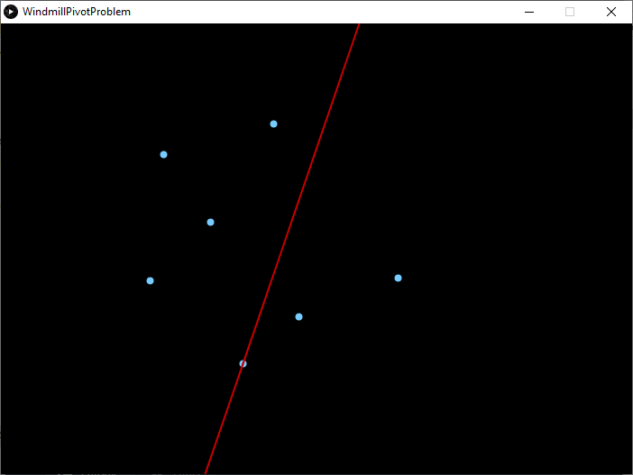

# WindmillPivotProblem

An attempt to recreate 3Blue1Brown's animation of the 2011 International Math Olympiad problem described in this video - https://www.youtube.com/watch?v=M64HUIJFTZM

MVP version currently. 

Current plan is to change how it detects collisions to help increase precision. 

At the moment is compares the distance between each pivot point and the line (or really two points that define the line).  
Planned alternative is to compare angle of current line with angle of each pivot point from the current pivot point.

After that, could include colour changing properties for the pivot points depending on which side of the line they're currently on.
